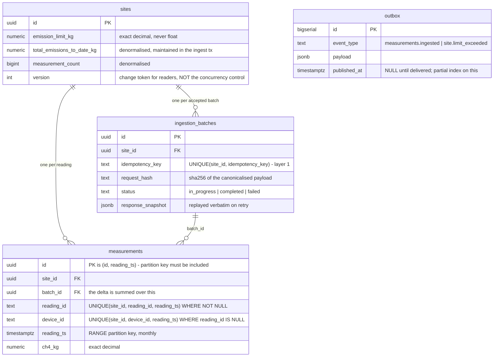
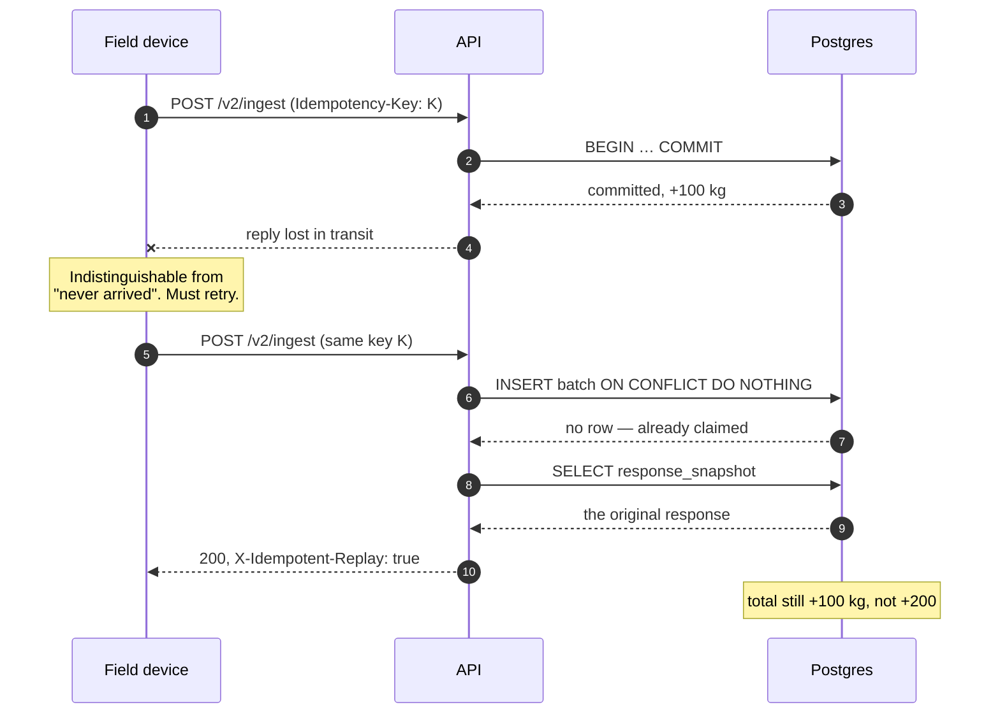
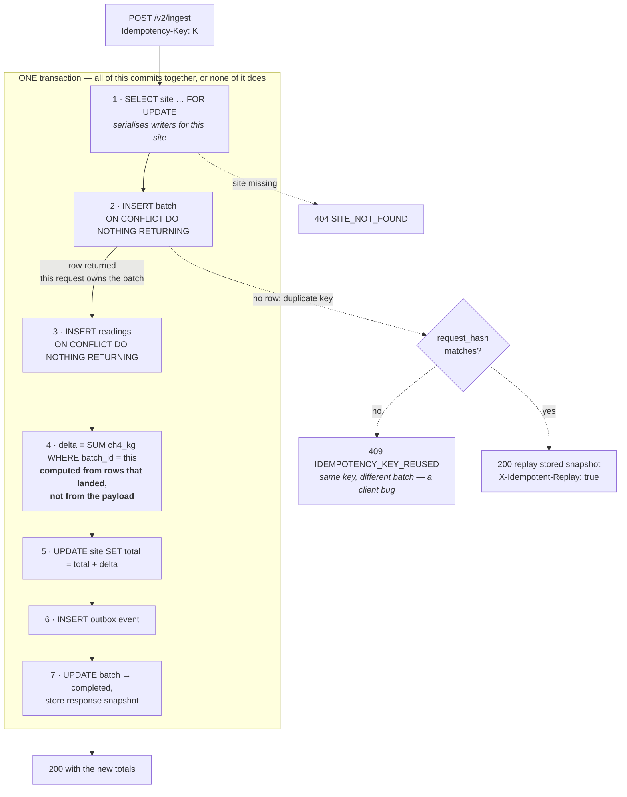

# Architecture

Emissions Ingestion & Analytics Engine — design decisions and the trade-offs
behind them.

The brief's central claim is that data integrity is non-negotiable: a lost packet
or a double-counted emission both misstate a regulatory total. Almost every
decision below follows from taking **both halves of that sentence seriously**,
including where they conflict.

---

## 1. Shape

```
apps/api          NestJS 11 + Drizzle + Postgres 16
apps/web          Next.js 16 App Router
packages/contracts  Zod schemas, error codes, response envelope — imported by both
```

A pnpm workspace, so the wire contract is one definition rather than two that
agree by convention. pnpm's strict `node_modules` also means an undeclared import
fails locally rather than in the Vercel or Railway build.

**Stack rationale.** NestJS because it is the house standard, and because four of
the bonus tasks map onto first-party features — global filters and interceptors
for the response envelope, `VersioningType.URI`, `@nestjs/cqrs` for the
command/processor split, `@nestjs/schedule` adjacent to the outbox dispatcher.
Drizzle over Prisma because the ingest path depends on emitting *specific* SQL —
`ON CONFLICT DO NOTHING`, `SELECT … FOR UPDATE`, `FOR UPDATE SKIP LOCKED` — and
an ORM that abstracts those away would be working against the graded content.

### Data model

The constraints are the design. Everything in §2 is a consequence of these four
tables and, in particular, of the two **partial** unique indexes on
`measurements` — which are mutually exclusive, so exactly one governs any given
row.



Both `measurements` indexes contain `reading_ts` because Postgres requires the
partition key in every unique constraint on a partitioned table. That
requirement is the cause of the `readingId` limitation in §9.

---

## 2. The core problem: counting each emission exactly once

The situation the whole design exists for. A device cannot distinguish "my
request never arrived" from "it arrived and the reply was lost", so it must
retry — and the second delivery must not be counted:



Two failure modes, and they pull in opposite directions:

- **Double-counting** — a client retries after a timeout and the batch is applied
  twice.
- **Silent loss** — a legitimate reading is mistaken for a duplicate and dropped.

Over-fitting to the first produces the second. The design uses two independent
layers, at two different levels, and reports rather than hides the case where
they cannot decide.

### Layer 1 — request identity (`Idempotency-Key`)

One key per request, supplied by the client, required in v2. Stored in
`ingestion_batches` with `UNIQUE (site_id, idempotency_key)`.

The key detail is that the check is not a check. A `SELECT` followed by an
`INSERT` leaves a window where two concurrent requests both conclude they are
first. Instead the handler **claims** the key atomically:

```ts
const [claimed] = await tx.insert(ingestionBatches)
  .values({ siteId, idempotencyKey, requestHash, status: 'in_progress', … })
  .onConflictDoNothing()
  .returning();

if (!claimed) return this.handleDuplicate(…);
```

Either a row comes back and this request owns the batch, or nothing comes back
and it is a duplicate. Under ten simultaneous retries Postgres admits exactly one
inserter.

On the duplicate path:

| Condition | Response |
|---|---|
| `request_hash` differs | **409 `IDEMPOTENCY_KEY_REUSED`** |
| `status = completed` | replay `response_snapshot`, `X-Idempotent-Replay: true` |
| otherwise | `BATCH_IN_PROGRESS` (see §8) |

The stored response is replayed **verbatim, not recomputed**. Recomputing would
let a later batch's totals leak into the answer for an earlier one — the client
would see a number that was never true for its request.

`request_hash` is SHA-256 over a *canonicalised* payload: readings sorted,
timestamps normalised to epoch millis, insignificant decimal zeros stripped. A
retry is not guaranteed to be byte-identical — a client may reserialise or
reorder — and rejecting that as key reuse would break exactly the retry this
system exists to support.

### Layer 2 — reading identity

A key only identifies a *request*. Two different requests can legitimately carry
the same readings, and Layer 1 must let the second through, because at the
request level it genuinely is new. Only reading-level identity stops the
double-count.

Two partial, mutually exclusive unique indexes on `measurements`:

```sql
UNIQUE (site_id, device_id,  reading_ts) WHERE reading_id IS NULL      -- fallback
UNIQUE (site_id, reading_id, reading_ts) WHERE reading_id IS NOT NULL  -- authoritative
```

**Why two.** Only the producer can know whether two readings describe the same
physical event. `(site, device, timestamp)` is a server-side *guess* at that — it
is right for a sensor emitting at most one reading per instant, and wrong for one
that does not. So `readingId` is authoritative where supplied, and the natural
key is the fallback for producers that cannot supply one, which is all v1
sensors.

The partial `WHERE` on the fallback is load-bearing: without it the natural key
would still block two distinct readings sharing a device and timestamp, making
`readingId` useless.

Readings insert with `ON CONFLICT DO NOTHING`, and — the part that makes the
whole scheme work — **the summary advances by what was inserted, not by what was
submitted**, computed in the database:

```sql
UPDATE sites SET total_emissions_to_date_kg = total_emissions_to_date_kg + $delta
```

where `$delta` is `SUM(ch4_kg)` over rows carrying this batch's `batch_id`.
Anything Layer 2 rejected is excluded automatically, and the addition is exact
`numeric` rather than float64.

### The transaction, end to end



Two things the picture makes plain that the prose has to spell out. **Everything
is inside one boundary** — measurements, summary, batch record and outbox event
become visible together or not at all. And **step 4 is where the no-double-count
guarantee actually lives**: the summary moves by what the database accepted, so
anything Layer 2 rejected is excluded without the application having to reason
about it.

### Honest note on the overlap

Because readings have natural identity, a defensible design could rely on Layer 2
alone and skip idempotency keys entirely. What Layer 1 adds beyond that is
narrower than it first looks:

- replaying the **exact original response**, so a retry is indistinguishable from
  the first call;
- detecting a **client bug** — same key, different payload — which Layer 2 would
  silently accept as a new batch.

Two mechanisms is a deliberate answer to "does your solution truly prevent
double-counting under stress," but they are not independently indispensable and
this document does not claim they are.

### When neither layer can decide

A collision whose stored mass **differs** is not a retry — a true retry resends
identical values. It means two distinct measurements are competing for one
identity and one was not stored. Those are logged, counted as
`emissions_ingest_duplicate_total{reason="value_conflict"}`, and returned in the
response's `conflicts[]`.

This is the "lost packet" half of the brief taken seriously: silently discarding
a measurement understates a regulatory total, and unlike a double-count nothing
downstream will ever contradict it.

---

## 3. Concurrency (bonus #1)

The ingest transaction takes a **pessimistic row lock on the site, first**:

```ts
const [site] = await tx.select().from(sites)
  .where(eq(sites.id, input.siteId)).for('update');
```

Being precise about what this does and does not buy, since it is easy to
overclaim:

**The counter does not need it.** `SET total = total + $delta` is a single atomic
statement; Postgres locks the row for its duration, so concurrent increments
cannot interleave.

**The read-then-decide does.** Limit-breach detection reads the total *before* the
update and compares after:

```ts
const wasWithinLimit = compare(site.total, site.limit) <= 0;
// …update…
if (wasWithinLimit && nowExceeded) → emit site.limit_exceeded
```

Without the lock, two concurrent batches could both observe "within limit", both
push the site over, and both alert — two notifications for one crossing. The lock
also guarantees the duplicate-replay path reads a *committed* batch rather than
racing one in flight.

**Pessimistic, not optimistic.** Every writer for a site touches the same counter
row, so under the brief's ten-concurrent-writer scenario collisions are
guaranteed, not rare. Optimistic locking would convert certain contention into
certain rollback-and-retry churn. The `version` column still increments, but as a
change token for readers — not as the concurrency control. It is documented as
such in the schema so nobody assumes otherwise.

**Deadlock.** Ingest locks exactly one row and does so before touching anything
else. With one lock there is no ordering to get wrong.

Contrast `outbox.dispatcher.ts`, which uses the same primitive with the opposite
intent: `FOR UPDATE SKIP LOCKED`. Ingest **waits** because that site's counter
must be updated; the dispatcher **skips** because any replica can deliver any
event, and waiting would serialise workers that could proceed in parallel.

---

## 4. Partitioning (bonus #3)

`measurements` is RANGE partitioned by month on `reading_ts`, with a
`create_month_partition(date)` helper and a `DEFAULT` partition.

Time-range partitions suit this workload because every access path is
time-scoped: ingest writes the current month, dashboards read recent windows,
regulatory reporting reads whole months. Old partitions detach and archive in
constant time rather than deleting row by row.

The `DEFAULT` partition is a deliberate safety net — a reading with a wrong clock
lands there rather than failing the insert. Losing a measurement is worse than
storing it in a suboptimal place.

**Trade-off: Drizzle cannot express `PARTITION BY`.** `drizzle/0000_init.sql` is
hand-written and `src/db/schema.ts` mirrors it purely so queries stay typed. The
two must be kept in step by hand. The alternative — abandoning either the ORM or
the partitioning — costs more.

**Partitions are not created on the ingest path.** `CREATE TABLE … PARTITION OF`
takes an `ACCESS EXCLUSIVE` lock on the parent, which under concurrent ingest
would serialise or deadlock writers. Partition creation belongs in a scheduled
job; the `DEFAULT` partition covers anything that arrives early.

---

## 5. Transactional outbox (bonus #4)

The outbox row is written **inside** the ingest transaction, so an event exists
if and only if the data does. Calling an alerting service over HTTP from the
handler would break that: the call could succeed and the transaction still roll
back, alerting on an emission that was never recorded.

The dispatcher claims work with `FOR UPDATE SKIP LOCKED`, so N API replicas
divide the queue with no coordination and no double delivery. It
**self-reschedules** rather than using `setInterval`: a fixed interval keeps
firing whether or not the previous pass finished, stacking overlapping passes
exactly when a slow downstream is already the problem.

Delivery is **at-least-once**, so the consumer must be idempotent — `id` is
provided as the de-duplication token, the same reasoning as `Idempotency-Key` one
layer further out. Failures increment `attempts` and leave the row unpublished;
the failure mode is delayed delivery, never lost delivery.

`site.limit_exceeded` fires only on the **transition** into breach, not on every
subsequent batch. An alerting service should learn that a site crossed its limit
once, not once per batch forever after.

---

## 6. Versioning (bonus #8)

URI versioning, and **no `defaultVersion`** — every route declares what it
answers to, so nothing resolves by implication.

| Route | Versions |
|---|---|
| `/sites`, `/sites/:id/metrics` | version-neutral + v1 + v2 |
| `/ingest` | v1 and v2 only — unversioned **404s** |

Sites and metrics are identical across versions, so there is nothing to
disambiguate and the brief's unversioned URLs work as written.

Ingest is strict because the two wire formats are not distinguishable by
inspection and **differ by a factor of 1000**: v1 reports grams and epoch
seconds, v2 kilograms and ISO-8601. A misresolved version would not fail — it
would succeed and write an emission total three orders of magnitude wrong into a
compliance record. A 404 is the correct answer to an ambiguous ingest.

v1 is kept as a separate controller with an anti-corruption adapter
(`fromLegacyIngest`) rather than optional fields on v2. Deployed firmware cannot
be changed on our schedule, so v1 must keep working unchanged; isolating it means
v2 can evolve without anyone reasoning about whether a change reaches a device in
a gas field.

Gram-to-kilogram conversion shifts the decimal **as a string**. `8.2 / 1000`
evaluates to `0.008199999999999999` in float64, and the artifact only appears for
fractional gram values — which is what makes it a bad bug to leave in: it
survives casual testing and then shows up in a regulatory total.

---

## 7. Platform conventions

**Response envelope** — every response, success or failure, is
`{ data, meta }` or `{ error, meta }`, applied by a global interceptor and
exception filter rather than per controller. A guarantee each team must remember
to opt into is not a guarantee.

Errors carry a machine-readable `code` from the shared contract, so the frontend
branches on codes and message wording stays free to change. Unhandled failures
return a generic message — an unhandled error can carry connection strings or row
contents — with the real cause logged against the request id the client was
shown.

**Money is never a float.** Regulatory quantities are `numeric` in Postgres and
**decimal strings on the wire**, never JSON numbers. Serialising through a
float64 would reintroduce exactly the rounding the column type exists to avoid.
Compliance comparison is exact decimal via BigInt, and a site *at* its limit is
within it — "Limit Exceeded" requires strictly greater.

**Observability (bonus #6)** — `emissions_ingest_duplicate_total` is split by the
layer that caught it, because conflating them hides which defence is working:

| `reason` | Meaning |
|---|---|
| `idempotent_replay` | Layer 1. Expected and benign; the number to watch when clients report timeouts |
| `key_reused` | Layer 1. A client bug — this one deserves an alert |
| `duplicate_reading` | Layer 2, per reading. A steady rate means a device is replaying its buffer |
| `value_conflict` | Neither layer could decide; a measurement was **not** stored |

---

## 8. Interpretations

Where the brief is deliberately loose, the reading taken and what would change
it.

### Dashboard freshness

"Real-time emission totals" is implemented as **~5 second polling**, not server
push. These are cumulative aggregates over industrial sites, where second-level
precision buys nothing against the operational cost of long-lived connections —
reconnect handling, heartbeats, and a stale-stream failure mode that shows wrong
numbers while looking healthy.

**What would change it:** a dashboard driving alarm response rather than
reporting. The upgrade is additive — the outbox events are already written
transactionally, so an `@Sse()` endpoint fed by the dispatcher touches neither
the schema nor the ingest transaction.

### `BATCH_IN_PROGRESS` is currently unreachable

Because ingest is a single transaction, an in-progress batch has not committed
and no other transaction can observe it; a rolled-back one leaves no row at all.
The code path is kept as a guard for an asynchronous pipeline, where a batch
genuinely can be claimed and still pending. It is documented as unreachable
rather than left looking like live code.

---

## 9. Known limitations

### `readingId` is unique per (site, timestamp), not per site

Re-sending the same `readingId` with a **different** timestamp stores and counts
both readings. The same id at the *same* timestamp is correctly detected.

**Cause.** Postgres requires every unique constraint on a partitioned table to
contain the partition key, so the identity index is necessarily
`(site_id, reading_id, reading_ts)`.

The general consequence is worth naming: **partitioning by time forces the
partition key into every uniqueness guarantee built on that table.** Any identity
enforced there is implicitly scoped to a partition key value, and it is easy to
miss because the index looks correct in isolation.

**Exposure today is nil** — `readingId` is optional and no current producer sends
one. The realistic future trigger is firmware that stamps at *send* time rather
than *sample* time, so retries carry fresh timestamps.

**The fix, if needed:** a non-partitioned `measurement_identities (site_id,
reading_id)` table written in the ingest transaction with `ON CONFLICT DO
NOTHING`. Strictly stronger than the current index and would make it redundant,
leaving one mechanism per case. Roughly 5–10 GB at 100M readings, hash
partitionable by `site_id`. Not implemented: it closes a hole in a feature with
no producers, and the time was better spent on the concurrency tests.

### Idempotency keys are never expired

`ingestion_batches` grows one row per batch indefinitely. Real implementations
expire these — Stripe retains 24 hours — because a key identifies a *delivery
attempt*, not a permanent entity. Production wants range partitioning on
`created_at` with a retention policy. `readingId` has no such option; it is the
row's identity and lives as long as the measurement.

### Timestamp resolution is milliseconds

`timestamptz` holds microseconds, but ingest converts through a JavaScript
`Date`, which does not. Irrelevant for methane telemetry (seconds to minutes); a
producer above 1 kHz must send `readingId`.

### Metrics are ephemeral, and nothing scrapes them

Counters live in the process. A redeploy or restart resets them to zero, and
because **no collector is deployed**, that history is not kept anywhere — today,
a redeploy loses the metrics outright.

With a Prometheus server scraping, the loss narrows but does not disappear:
history lives in its TSDB, `rate()` and `increase()` recognise a counter reset
rather than reading it as a negative rate, and
`emissions_process_start_time_seconds` marks the restart. Events between the last
scrape and the restart are still lost — typically 15–60 seconds' worth. That is
an accepted trade in the pull model rather than a solved problem.

Persisting counters in the application would mean shared state written on every
increment, on the hot path, for no benefit; Prometheus assumes ephemeral targets
by design.

**The useful distinction is that a number needing to survive a restart is data,
not a metric.** The counts that matter for integrity already are data:
`ingestion_batches` records every accepted batch with its submitted and accepted
totals, so Layer 2 duplicate readings are permanently recoverable in SQL. The two
that are not — `idempotent_replay` and `key_reused` — write no row, and are
diagnostic rather than authoritative. Making them durable would mean recording a
row, not persisting a counter.

Deploying a collector (Grafana Cloud's free tier can scrape the API directly) is
infrastructure the brief does not ask for and is not set up here.

### Single-instance assumptions

The metrics registry is in-process, so a scrape reflects one replica. The SSE
upgrade described above would need Redis pub/sub for fan-out across replicas —
Redis is already in the compose file and otherwise unused.

---

## 10. Deliberately not built

- **Authentication.** The brief describes an admin dashboard, not an auth
  exercise. A login wall between a reviewer and the demo costs more than it
  proves.
- **Caching.** Redis is provisioned and unused. The one hot read — the site
  summary — is already a single indexed row read, and a cache in front of a
  compliance figure introduces a staleness question with no matching benefit.
- **Partition automation.** The helper exists; scheduling it does not. The
  `DEFAULT` partition makes it non-urgent.
- **Retention.** Discussed above; no policy implemented.

---

## 11. Verifying the claims

Nothing above is asserted without a test behind it. `pnpm test` runs 74 tests
against real Postgres — no mocks, because everything under test (`ON CONFLICT`
semantics, `SELECT FOR UPDATE`, exact `numeric` arithmetic, partition routing) is
database behaviour.

The two that matter:

| Test | Asserts |
|---|---|
| 10 identical requests, one key | exactly one applied, nine replayed **byte-identically**, total +200 once |
| 10 distinct batches, one site | all ten applied, total exactly +100 — no lost updates |

Every integration test ends by asserting the denormalised summary **and** the
recomputed `SUM(measurements)` both match; checking one alone would miss a bug
that corrupts them together. `pnpm db:verify` performs the same reconciliation
against live data and exits non-zero on drift, reporting the direction — stored
above actual means double-counting, below means a lost update.
