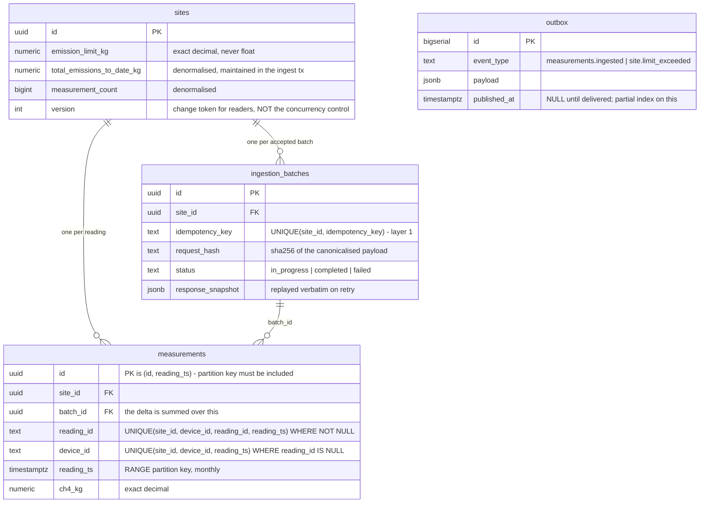
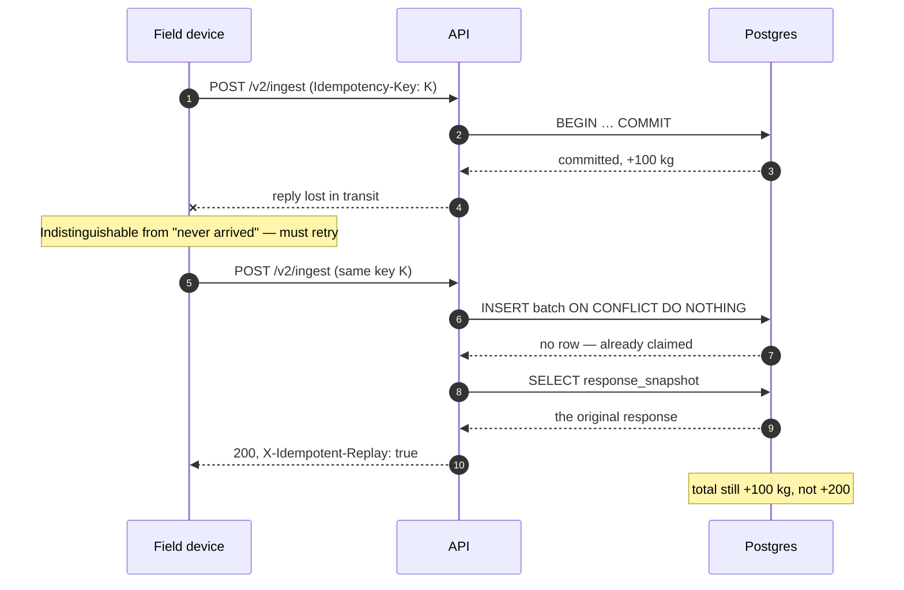
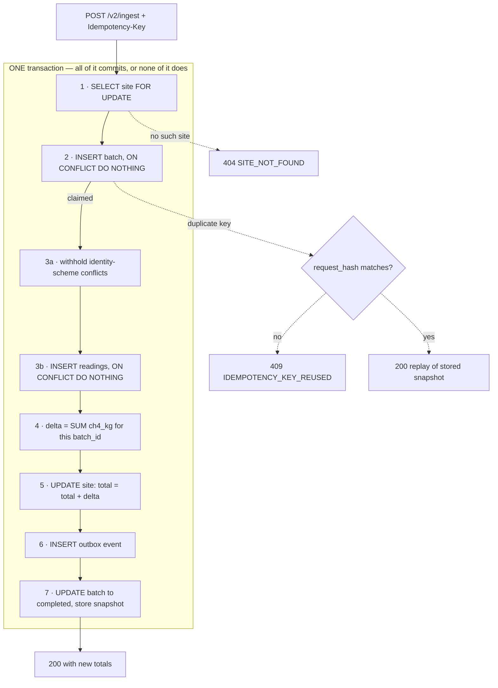

# Architecture

Emissions Ingestion & Analytics Engine — design decisions and the trade-offs
behind them.

The brief's central claim is that data integrity is non-negotiable: a lost packet
or a double-counted emission both misstate a regulatory total. Almost every
decision below follows from taking **both halves of that sentence seriously**,
including where they conflict.

---

## 1. Shape

```
apps/api          NestJS 11 + Drizzle + Postgres 16
apps/web          Next.js 16 App Router
packages/contracts  Zod schemas, error codes, response envelope — imported by both
```

A pnpm workspace, so the wire contract is one definition rather than two that
agree by convention. pnpm's strict `node_modules` also means an undeclared import
fails locally rather than in the Vercel or Railway build.

**Stack rationale.** NestJS because it is the house standard, and because four of
the bonus tasks map onto first-party features — global filters and interceptors
for the response envelope, `VersioningType.URI`, `@nestjs/cqrs` for the
command/processor split, `@nestjs/schedule` adjacent to the outbox dispatcher.
Drizzle over Prisma because the ingest path depends on emitting _specific_ SQL —
`ON CONFLICT DO NOTHING`, `SELECT … FOR UPDATE`, `FOR UPDATE SKIP LOCKED` — and
an ORM that abstracts those away would be working against the graded content.

### Data model

The constraints are the design. Everything in §2 is a consequence of these four
tables and, in particular, of the two **partial** unique indexes on
`measurements` — which are mutually exclusive, so exactly one governs any given
row.



Both `measurements` indexes contain `reading_ts` because Postgres requires the
partition key in every unique constraint on a partitioned table. That requirement
means neither index can enforce identity _across_ timestamps, which is why the
`readingId` rule is completed in the ingest transaction rather than by the index
alone — see §2.

---

## 2. The core problem: counting each emission exactly once

The situation the whole design exists for. A device cannot distinguish "my
request never arrived" from "it arrived and the reply was lost", so it must
retry — and the second delivery must not be counted:



Two failure modes, and they pull in opposite directions:

- **Double-counting** — a client retries after a timeout and the batch is applied
  twice.
- **Silent loss** — a legitimate reading is mistaken for a duplicate and dropped.

Over-fitting to the first produces the second. The design uses two independent
layers, at two different levels, and reports rather than hides the case where
they cannot decide.

### Layer 1 — request identity (`Idempotency-Key`)

One key per request, supplied by the client, required in v2. Stored in
`ingestion_batches` with `UNIQUE (site_id, idempotency_key)`.

The key detail is that the check is not a check. A `SELECT` followed by an
`INSERT` leaves a window where two concurrent requests both conclude they are
first. Instead the handler **claims** the key atomically:

```ts
const [claimed] = await tx.insert(ingestionBatches)
  .values({ siteId, idempotencyKey, requestHash, status: 'in_progress', … })
  .onConflictDoNothing()
  .returning();

if (!claimed) return this.handleDuplicate(…);
```

Either a row comes back and this request owns the batch, or nothing comes back
and it is a duplicate. Under ten simultaneous retries Postgres admits exactly one
inserter.

On the duplicate path:

| Condition              | Response                                                |
| ---------------------- | ------------------------------------------------------- |
| `request_hash` differs | **409 `IDEMPOTENCY_KEY_REUSED`**                        |
| `status = completed`   | replay `response_snapshot`, `X-Idempotent-Replay: true` |
| otherwise              | `BATCH_IN_PROGRESS` (see §8)                            |

The stored response is replayed **verbatim, not recomputed**. Recomputing would
let a later batch's totals leak into the answer for an earlier one — the client
would see a number that was never true for its request.

`request_hash` is SHA-256 over a _canonicalised_ payload: readings sorted,
timestamps normalised to epoch millis, insignificant decimal zeros stripped. A
retry is not guaranteed to be byte-identical — a client may reserialise or
reorder — and rejecting that as key reuse would break exactly the retry this
system exists to support.

### Layer 2 — reading identity

A key only identifies a _request_. Two different requests can legitimately carry
the same readings, and Layer 1 must let the second through, because at the
request level it genuinely is new. Only reading-level identity stops the
double-count.

Two partial, mutually exclusive unique indexes on `measurements`, both rooted at
`(site, device)` and differing only in what identifies a reading within it:

```sql
UNIQUE (site_id, device_id,             reading_ts) WHERE reading_id IS NULL      -- fallback
UNIQUE (site_id, device_id, reading_id, reading_ts) WHERE reading_id IS NOT NULL  -- authoritative
```

**Why two.** Only the producer can know whether two readings describe the same
physical event. `(site, device, timestamp)` is a server-side _guess_ at that — it
is right for a sensor emitting at most one reading per instant, and wrong for one
that does not. So `readingId` is authoritative where supplied, and the natural
key is the fallback for producers that cannot supply one, which is all v1
sensors.

The partial `WHERE` on the fallback is load-bearing: without it the natural key
would still block two distinct readings sharing a device and timestamp, making
`readingId` useless.

**Why `readingId` needs help from the application.** Both indexes must contain
`reading_ts`, because it is the partition key. So the authoritative index cannot
enforce that an id is unique _across_ timestamps: `('r-1', 10:00)` and
`('r-1', 11:00)` are distinct entries and `ON CONFLICT` admits both, storing the
same measurement twice. That is exactly the case the contract tells producers to
send a `readingId` for — a device recovering from a clock correction — so leaving
it to the index would have broken the feature's stated purpose.

The ingest transaction closes it by looking the identity up across all timestamps
before inserting, and withholding a match: silently when the mass agrees, since
that is the retry working, and as a reported `value_conflict` when it does not,
since then two distinct measurements are claiming one id. The lookup is a plain
`SELECT` rather than a claim, because the site row lock from §3 is already held
for the whole transaction and no other ingest for that site can interleave.

This is the one identity rule Postgres cannot express on this table. A
non-partitioned `measurement_identities (site_id, device_id, reading_id)` table
could — see §9 for why it is not built yet.

Readings insert with `ON CONFLICT DO NOTHING`, and — the part that makes the
whole scheme work — **the summary advances by what was inserted, not by what was
submitted**, computed in the database:

```sql
UPDATE sites SET total_emissions_to_date_kg = total_emissions_to_date_kg + $delta
```

where `$delta` is `SUM(ch4_kg)` over rows carrying this batch's `batch_id`.
Anything Layer 2 rejected is excluded automatically, and the addition is exact
`numeric` rather than float64.

### The transaction, end to end



Step 1 serialises writers for that site. Step 4 is the one that matters: the
delta is summed from the rows that actually landed, so anything step 3b rejected
is excluded without the application reasoning about it.

Step 3a runs **before** the insert, not after. It withholds readings the schema
cannot adjudicate (see _When neither layer can decide_), so they are never stored
and never reach the sum — checking afterwards would report a conflict for a row
already counted.

**Everything is inside one boundary** — measurements, summary, batch record and
outbox event become visible together or not at all. That is what makes the
guarantee a property of the database rather than of the code's control flow.

### Honest note on the overlap

Because readings have natural identity, a defensible design could rely on Layer 2
alone and skip idempotency keys entirely. What Layer 1 adds beyond that is
narrower than it first looks:

- replaying the **exact original response**, so a retry is indistinguishable from
  the first call;
- detecting a **client bug** — same key, different payload — which Layer 2 would
  silently accept as a new batch.

Two mechanisms is a deliberate answer to "does your solution truly prevent
double-counting under stress," but they are not independently indispensable and
this document does not claim they are.

### When neither layer can decide

Two cases reach the server as genuinely ambiguous. Both are withheld from the
insert and returned in the response's `conflicts[]` rather than guessed at.

**A collision carrying a different mass.** A true retry resends identical values,
so a differing mass is not a retry — two distinct measurements are competing for
one identity and one was not stored. Counted as
`emissions_ingest_duplicate_total{reason="value_conflict"}`.

**Two readings at one instant disagreeing about identity.** A `(site, device,
timestamp)` may hold identified readings or one unidentified reading, never both.
The two partial indexes cover disjoint sets of rows — one sees only rows without
a reading id, the other only rows with one — so neither adjudicates such a pair
and the database would accept both, storing one measurement twice. Counted as
`emissions_ingest_duplicate_total{reason="mixed_identity"}`.

Both resolve the same way, and for the same reason: only the producer knows
whether this is one measurement or two, and withholding is the recoverable
direction. A reading held back can be re-sent once its identity is unambiguous;
a duplicated regulatory total has nothing downstream to contradict it.

That asymmetry is the "lost packet" half of the brief taken seriously — silently
discarding a measurement understates a total just as surely as counting one
twice, and is the harder of the two to ever notice.

**Why refusing is cheap here.** The check rests on a domain fact worth stating
outright: methane telemetry samples in seconds to minutes, so two genuine
readings from one device at the same _millisecond_ do not occur. When an
identified and an unidentified reading collide at one instant, the overwhelmingly
likely explanation is one measurement described twice — a device mid-upgrade
replaying its buffer, or a mixed fleet sharing a device name. The false-positive
cost of refusing is therefore close to nil, while accepting risks a permanent,
silent overstatement of a regulatory figure.

**Checked in all three arrival patterns**, because the ambiguity is a property of
the data and must not depend on packaging:

| Arrival                                 | Outcome                                                                                 |
| --------------------------------------- | --------------------------------------------------------------------------------------- |
| both readings in one request            | `400 VALIDATION_ERROR` — nothing stored yet, so there is no partial success to describe |
| unidentified stored, identified arrives | withheld, `conflicts[]`                                                                 |
| identified stored, unidentified arrives | withheld, `conflicts[]`                                                                 |

Covering only the middle row would be cheaper and is the tempting simplification,
since it is the direction a fleet upgrade actually produces. It would also make
the outcome depend on which reading happened to arrive first, and let the pair
through whenever they shared a request. A guarantee that can be bypassed by
batching is not a guarantee.

**What it costs.** One `SELECT` per ingest, before the insert, including for
batches carrying no `readingId` at all — the common case, since no v1 sensor
sends one. Skipping it there is the obvious optimisation and the reason the third
row is easy to miss: catching an unidentified reading arriving over a stored
identified one means looking even when the batch supplies no ids.

Making it indexable took one non-obvious step. The natural predicate is an `OR`
of `(device, instant)` pairs, and Postgres cannot lift `reading_ts` out of that
into an index condition — it probes on `site_id` alone and filters the rest,
reading every measurement the site recorded in that partition. Harmless on demo
data, ruinous at the 100M rows this schema is partitioned for. Restating the
instants as a separate `reading_ts IN (…)` — logically redundant, since every
`OR` branch already pins one — lets `(site_id, reading_ts)` serve both columns:

```
Index Cond: (site_id = … AND reading_ts = …)     with the IN
Index Cond: (site_id = …)                        without it
```

Both plans return the same rows; only one stays bounded as the table grows.

---

## 3. Concurrency (bonus #1)

The ingest transaction takes a **pessimistic row lock on the site, first**:

```ts
const [site] = await tx
  .select()
  .from(sites)
  .where(eq(sites.id, input.siteId))
  .for('update');
```

Being precise about what this does and does not buy, since it is easy to
overclaim:

**The counter does not need it.** `SET total = total + $delta` is a single atomic
statement; Postgres locks the row for its duration, so concurrent increments
cannot interleave.

**The read-then-decide does.** Limit-breach detection reads the total _before_ the
update and compares after:

```ts
const wasWithinLimit = compare(site.total, site.limit) <= 0;
// …update…
if (wasWithinLimit && nowExceeded) → emit site.limit_exceeded
```

Without the lock, two concurrent batches could both observe "within limit", both
push the site over, and both alert — two notifications for one crossing. The lock
also guarantees the duplicate-replay path reads a _committed_ batch rather than
racing one in flight.

**Pessimistic, not optimistic.** Every writer for a site touches the same counter
row, so under the brief's ten-concurrent-writer scenario collisions are
guaranteed, not rare. Optimistic locking would convert certain contention into
certain rollback-and-retry churn. The `version` column still increments, but as a
change token for readers — not as the concurrency control. It is documented as
such in the schema so nobody assumes otherwise.

**Deadlock.** Ingest locks exactly one row and does so before touching anything
else. With one lock there is no ordering to get wrong.

Contrast `outbox.dispatcher.ts`, which uses the same primitive with the opposite
intent: `FOR UPDATE SKIP LOCKED`. Ingest **waits** because that site's counter
must be updated; the dispatcher **skips** because any replica can deliver any
event, and waiting would serialise workers that could proceed in parallel.

---

## 4. Partitioning (bonus #3)

`measurements` is RANGE partitioned by month on `reading_ts`, with a
`create_month_partition(date)` helper and a `DEFAULT` partition.

Time-range partitions suit this workload because every access path is
time-scoped: ingest writes the current month, dashboards read recent windows,
regulatory reporting reads whole months. Old partitions detach and archive in
constant time rather than deleting row by row.

The `DEFAULT` partition is a deliberate safety net — a reading with a wrong clock
lands there rather than failing the insert. Losing a measurement is worse than
storing it in a suboptimal place.

**Trade-off: Drizzle cannot express `PARTITION BY`.** `drizzle/0000_init.sql` is
hand-written and `src/db/schema.ts` mirrors it purely so queries stay typed. The
two must be kept in step by hand. The alternative — abandoning either the ORM or
the partitioning — costs more.

**Partitions are not created on the ingest path.** `CREATE TABLE … PARTITION OF`
takes an `ACCESS EXCLUSIVE` lock on the parent, which under concurrent ingest
would serialise or deadlock writers. Partition creation belongs in a scheduled
job; the `DEFAULT` partition covers anything that arrives early.

---

## 5. Transactional outbox (bonus #4)

The outbox row is written **inside** the ingest transaction, so an event exists
if and only if the data does. Calling an alerting service over HTTP from the
handler would break that: the call could succeed and the transaction still roll
back, alerting on an emission that was never recorded.

### Claiming

A claim is an `UPDATE … SET claimed_at = now()` wrapped around a
`SELECT … FOR UPDATE SKIP LOCKED`, in one statement.

`SKIP LOCKED` alone is not enough, and it is worth being precise about why.
It excludes dispatchers that are selecting _at the same instant_, but the lock
lives only as long as the claiming transaction — and delivery is an HTTP call
made after that transaction commits. The interval that actually needs protecting
is the one the lock has already stopped covering. So the claim is written into
the row: `claimed_at` outlives the transaction, and rows whose lease is still
live are skipped by every other dispatcher.

That makes the lease the unit of safety, with two consequences worth stating:

- **`LEASE_MS` must exceed worst-case delivery time.** If it expires mid-flight,
  a second dispatcher takes the row and delivers it again.
- **A dispatcher that dies mid-delivery strands its rows only until the lease
  lapses**, rather than permanently. That is the property the lease buys back for
  the cost of the redelivery window above.

Rows at `MAX_ATTEMPTS` are excluded from claims entirely. A permanently failing
row would otherwise keep its place in `ORDER BY id LIMIT 50` on every pass, and
enough of them fill the batch — at which point the queue behind them stops moving
altogether. Excluding them is what keeps one poisoned event from being an outage.
They are counted separately in `emissions_outbox_dead_lettered` rather than
folded into the pending gauge, because "delivery has stalled" and "these have
already been triaged" warrant different responses.

The dispatcher **self-reschedules** rather than using `setInterval`: a fixed
interval keeps firing whether or not the previous pass finished, stacking
overlapping passes exactly when a slow downstream is already the problem.

### Delivery semantics

Delivery is **at-least-once**, so the consumer must be idempotent — `id` is
provided as the de-duplication token, the same reasoning as `Idempotency-Key` one
layer further out. Failures increment `attempts` and leave the row unpublished
with its stamp intact, so the lease doubles as retry backoff: a downstream blip
shorter than the lease costs one attempt rather than burning all ten in ten
seconds of polling. The failure mode is delayed delivery, never lost delivery.

`site.limit_exceeded` fires only on the **transition** into breach, not on every
subsequent batch. An alerting service should learn that a site crossed its limit
once, not once per batch forever after.

---

## 6. Versioning (bonus #8)

URI versioning, and **no `defaultVersion`** — every route declares what it
answers to, so nothing resolves by implication.

| Route                          | Versions                  |
| ------------------------------ | ------------------------- |
| `/sites`, `/sites/:id/metrics` | version-neutral + v1 + v2 |
| `/ingest`                      | version-neutral + v2      |
| `/v1/ingest`                   | v1 only                   |

Every URL the brief writes works as written. Sites and metrics are identical
across versions, so there is nothing to disambiguate.

**The unversioned `/ingest` is pinned to v2, not bound to the newest version.**
This is the distinction that makes an unversioned write path safe: a caller who
omits the version integrated against the semantics documented at the time, and a
later format must not change what their existing request means. A new version is
opted into by naming it. `/ingest` therefore stays on v2 whatever else is added
beside it.

The alternative — resolving unversioned to "latest" — moves a write endpoint's
meaning underneath its callers on a schedule they do not control, which on an
ingest path means the mass and timestamp units of a compliance record changing
without the client asking.

The two formats are in no danger of being confused for one another: their field
names are disjoint (`site_id`/`ch4_grams` against `siteId`/`ch4Kg`), so a v1
payload sent to a v2 route fails validation with field-level errors rather than
being misread. The pinning exists for the stability of the contract, not to
disambiguate the payloads.

v1 is kept as a separate controller with an anti-corruption adapter
(`fromLegacyIngest`) rather than optional fields on v2. Deployed firmware cannot
be changed on our schedule, so v1 must keep working unchanged; isolating it means
v2 can evolve without anyone reasoning about whether a change reaches a device in
a gas field.

Gram-to-kilogram conversion shifts the decimal **as a string**. `8.2 / 1000`
evaluates to `0.008199999999999999` in float64, and the artifact only appears for
fractional gram values — which is what makes it a bad bug to leave in: it
survives casual testing and then shows up in a regulatory total.

---

## 7. Platform conventions

This section is written as a contract rather than a description: it is what a
second team building alongside this service would implement to look like part of
the same platform.

### The envelope

Every response carries one of two shapes. There is no third.

```jsonc
{ "data": <payload>, "meta": { "requestId": "…", "timestamp": "…" } }
{ "error": { "code": "…", "message": "…", "details": [] }, "meta": { … } }
```

Applied by a **global** interceptor and exception filter, never per controller.
A guarantee each team has to remember to opt into is not a guarantee — this way
no handler can ship a different shape, including handlers nobody has written yet.

`data` is the payload and nothing else. Anything _about_ the response — paging,
timing, correlation — belongs in `meta`, so a field can be added to `meta`
without changing the shape of any payload.

### Errors

- `code` is the contract; `message` is for humans. Clients branch on `code`, and
  message wording stays free to change without it being a breaking change.
- Codes live in `@emissions/contracts` with their HTTP status beside them in
  `ERROR_STATUS`, so the code-to-status relationship exists in exactly one place.
- `details` is populated for field-level failures as `{ path, message }[]`, and
  is an empty array otherwise. It is never a free-text dumping ground.
- Adding a code is backwards-compatible. Changing or removing one is not.
- Unhandled failures return a generic message. An unhandled error can carry a
  connection string or row contents, and the real cause is logged against the
  request id the client was shown.

### Collections

Paginated endpoints take `?limit=&cursor=` and answer with the page details in
`meta.page`:

```jsonc
{ "data": [ … ], "meta": { …, "page": { "limit": 50, "nextCursor": "…" } } }
```

- `limit` defaults to 50 and is capped at 200. An uncapped collection endpoint is
  one request away from being a denial of service against itself.
- **Cursors are keyset, not offsets.** An offset shifts when rows are inserted or
  reordered between pages, silently skipping or repeating records; a cursor names
  a position in the sort order and cannot. This requires a _total_ ordering — one
  with no ties — which is why site listing orders by `(name, id)`.
- A cursor is opaque. Clients hand back what they were given and never construct
  or parse one, which leaves the ordering free to change.
- `nextCursor: null` means the last page. A malformed cursor is a
  `VALIDATION_ERROR`, never a silent restart from the beginning.

### Correlation

`X-Request-Id` is honoured if supplied and generated otherwise, echoed as a
response header, and included in every `meta` — including on errors and on routes
that do not exist. A user reporting a failure can quote the id they were shown
and have it match log lines exactly.

### Deprecation

An endpoint being retired answers with `Deprecation: true` and a `Link` header
naming its successor, as `/v1/ingest` does. The old contract keeps working
unchanged; discovery of the new one is in the response rather than in a document
the client's author may never read.

**Money is never a float.** Regulatory quantities are `numeric` in Postgres and
**decimal strings on the wire**, never JSON numbers. Serialising through a
float64 would reintroduce exactly the rounding the column type exists to avoid.
Compliance comparison is exact decimal via BigInt, and a site _at_ its limit is
within it — "Limit Exceeded" requires strictly greater.

**Observability (bonus #6)** — `emissions_ingest_duplicate_total` is split by the
layer that caught it, because conflating them hides which defence is working:

| `reason`            | Meaning                                                                        |
| ------------------- | ------------------------------------------------------------------------------ |
| `idempotent_replay` | Layer 1. Expected and benign; the number to watch when clients report timeouts |
| `key_reused`        | Layer 1. A client bug — this one deserves an alert                             |
| `duplicate_reading` | Layer 2, per reading. A steady rate means a device is replaying its buffer     |
| `value_conflict`    | Neither layer could decide; a measurement was **not** stored                   |

---

## 8. Interpretations

Where the brief is deliberately loose, the reading taken and what would change
it.

### Dashboard freshness

"Real-time emission totals" is implemented as **~5 second polling**, not server
push. These are cumulative aggregates over industrial sites, where second-level
precision buys nothing against the operational cost of long-lived connections —
reconnect handling, heartbeats, and a stale-stream failure mode that shows wrong
numbers while looking healthy.

**What would change it:** a dashboard driving alarm response rather than
reporting. The upgrade is additive — the outbox events are already written
transactionally, so a **Server-Sent Events** endpoint (`@Sse()`, an HTTP response
held open so the server can push as events occur) fed by the dispatcher touches
neither the schema nor the ingest transaction. SSE rather than WebSockets because
the dashboard only needs server-to-client traffic, and SSE reconnects natively
over ordinary HTTP without an upgrade handshake or sticky sessions.

The stream would have to be treated as best-effort, not as the source of truth:
the client refetches full state over REST on connect and reconnect, so a missed
event self-heals rather than leaving the dashboard quietly wrong.

### `BATCH_IN_PROGRESS` is currently unreachable

Because ingest is a single transaction, an in-progress batch has not committed
and no other transaction can observe it; a rolled-back one leaves no row at all.
The code path is kept as a guard for an asynchronous pipeline, where a batch
genuinely can be claimed and still pending. It is documented as unreachable
rather than left looking like live code.

---

## 9. Known limitations

### `readingId` uniqueness is enforced by the application, not by a constraint

The rule — one measurement per `(site, device, readingId)`, at any timestamp — is
checked by a `SELECT` in the ingest transaction (§2), because no index on
`measurements` can express it.

**Cause.** Postgres requires every unique constraint on a partitioned table to
contain the partition key, so the identity index is necessarily
`(site_id, device_id, reading_id, reading_ts)` and is therefore scoped per
timestamp.

The general consequence is worth naming: **partitioning by time forces the
partition key into every uniqueness guarantee built on that table.** Any identity
enforced there is implicitly scoped to a partition key value, and it is easy to
miss because the index looks correct in isolation.

**What this costs.** A rule enforced by application code is only as strong as
every writer remembering to apply it. The ingest handler is the only writer that
does; `db/seed.ts` inserts into `measurements` directly and bypasses it. The seed
sends no `readingId`, so nothing is wrong today, but the shape of the hazard is
real — a second write path would silently not be covered.

It also costs a lookup that cannot prune on the partition key, so it probes every
partition. Measured at 14 partitions, the worst case — a 100-reading batch, all
identified — plans in ~1 ms and executes in ~0.2 ms as a `VALUES` join. Planning
scales with `readings × partitions`; execution scales with how many rows one site
holds.

**The fix, when it is needed:** a non-partitioned
`measurement_identities (site_id, device_id, reading_id)` table written in the
ingest transaction with `ON CONFLICT DO NOTHING`. It would make the rule a
database guarantee immune to a forgetful writer, and reduce the lookup to a single
indexed probe with no fan-out. Roughly 5–10 GB at 100M readings, hash partitionable
by `site_id`.

Not built yet because the site lock already provides the serialisation it would
add, and one enforcement path is simpler than two while there is one writer. The
number to watch is **rows per site**, not partition count: partitions only affect
planning time, while the per-site row count drives the scan and is what will bind
first.

### The error-code namespace is flat

Codes are a single flat enum, which works while one team owns them. `NOT_FOUND`
and `SITE_NOT_FOUND` already sit side by side; a second team adding a
`NOT_FOUND` for its own domain would collide.

A registry serving several teams wants namespacing — `sites.not_found`,
`ingest.idempotency_key_reused` — or an owner recorded per code. Not done here
because renaming the codes would churn the contract and its tests to serve a
second team that does not exist yet, and the migration is mechanical whenever one
does.

### There is no machine-readable API document

The contract is expressed as Zod schemas, which serve TypeScript consumers
directly and are the reason the dashboard cannot drift from the API. A consumer
in another language gets nothing from them.

A standard several teams build against normally ships an OpenAPI document —
`@nestjs/swagger` plus a Zod-to-OpenAPI bridge would generate one from the same
schemas, keeping a single source of truth. Not built: no non-TypeScript consumer
exists, and an OpenAPI document that nothing consumes is a second artifact to
keep honest.

Related: correlation uses `X-Request-Id`, which is ours. Tracing across service
boundaries is standardised on W3C `traceparent`, and a multi-service deployment
would want to accept and propagate it rather than invent a header.

### Writes to one site are serialised

The brief asks for concurrency _safety_ and storage _volume_ — "high-concurrency
updates", "10 concurrent sources updating the same `site_id`", "100M+ rows". It
does not state a throughput requirement, and this design trades per-site write
throughput for correctness deliberately.

The row lock in §3 means writes to a single site proceed one at a time. Writes to
_different_ sites take different locks and do not contend.

A rough local probe — 40 concurrent batches of 50 readings — showed no
measurable difference between targeting one site and spreading across four
(~33 batches/s either way). That number is not a benchmark: the harness forked 40
`curl` processes, so it very likely measured the client. The useful signal is the
_shape_ — per-site serialisation cost nothing detectable, meaning the lock is
held for a small fraction of request time and is not the first thing that would
bind.

**If per-site throughput did become a requirement**, in increasing order of cost:

1. **Sharded counters** — N counter rows per site, summed on read. Removes the
   single hot row while keeping the update synchronous and consistent.
2. **Asynchronous summary** — persist measurements in the request, update the
   total from an outbox consumer. Trades read-your-writes for write throughput.
3. **Accept-then-process** — return `202 Accepted`, enqueue, process off the
   request path. Highest ceiling, but it changes the contract: ingest could no
   longer return the resulting total, and the dashboard could no longer show the
   effect of a submission immediately.

The brief pushes away from (3): `/ingest` is specified as atomic, and the
compliance status it returns is the point. Synchronous is the right reading of
the requirement, and the ceiling is a consequence of it rather than an oversight.

### Idempotency keys are never expired

`ingestion_batches` grows one row per batch indefinitely. Real implementations
expire these — Stripe retains 24 hours — because a key identifies a _delivery
attempt_, not a permanent entity. Production wants range partitioning on
`created_at` with a retention policy. `readingId` has no such option; it is the
row's identity and lives as long as the measurement.

That expected retention is why **`measurements.batch_id` is not a foreign key**.
A batch record is transient; a measurement is a permanent regulatory record.
Constraining one to the other would mean either blocking the expiry or, with a
cascade, deleting measurements when idempotency keys are pruned — losing
emissions data in order to tidy up delivery bookkeeping. A dangling `batch_id`
after expiry is the better of the two failure modes, and the column is
`NOT NULL` so a reading always records which batch delivered it.

The cost is that referential integrity here is a convention rather than a
constraint, so nothing stops a writer inventing a `batch_id`. Ingest cannot: it
sums the delta over the batch id it just claimed, so an invented one would sum
to zero and move no total.

### Timestamp resolution is milliseconds

`timestamptz` holds microseconds, but ingest converts through a JavaScript
`Date`, which does not. Irrelevant for methane telemetry (seconds to minutes); a
producer above 1 kHz must send `readingId`.

### Metrics are ephemeral, and nothing scrapes them

Counters live in the process. A redeploy or restart resets them to zero, and
because **no collector is deployed**, that history is not kept anywhere — today,
a redeploy loses the metrics outright.

With a Prometheus server scraping, the loss narrows but does not disappear:
history lives in its TSDB, `rate()` and `increase()` recognise a counter reset
rather than reading it as a negative rate, and
`emissions_process_start_time_seconds` marks the restart. Events between the last
scrape and the restart are still lost — typically 15–60 seconds' worth. That is
an accepted trade in the pull model rather than a solved problem.

Persisting counters in the application would mean shared state written on every
increment, on the hot path, for no benefit; Prometheus assumes ephemeral targets
by design.

**The useful distinction is that a number needing to survive a restart is data,
not a metric.** The counts that matter for integrity already are data:
`ingestion_batches` records every accepted batch with its submitted and accepted
totals, so Layer 2 duplicate readings are permanently recoverable in SQL. The two
that are not — `idempotent_replay` and `key_reused` — write no row, and are
diagnostic rather than authoritative. Making them durable would mean recording a
row, not persisting a counter.

Deploying a collector (Grafana Cloud's free tier can scrape the API directly) is
infrastructure the brief does not ask for and is not set up here.

### Single-instance assumptions

The metrics registry is in-process, so a scrape reflects one replica. The SSE
upgrade described above would need Redis pub/sub for fan-out across replicas —
Redis is already in the compose file and otherwise unused.

Rate limiting is also per-process: the throttler counts in memory, so N replicas
permit N times the configured ceiling. Correct enforcement across replicas needs
a shared counter, which is the other thing Redis would earn its place doing. The
limit here is a courtesy guard on a public write surface rather than a security
control, so a factor-of-N ceiling is acceptable and named rather than fixed.

### `/metrics` is open unless a token is set

`METRICS_TOKEN` gates the endpoint; unset leaves it public. Unset is the right
default for local development and for a demo whose README invites a reviewer to
curl it, and the wrong one for an operational deployment — the exposition
describes ingest volume, site count, and error rates, and the default process
collectors add runtime and version detail. The production deployment logs a
warning at boot when the variable is missing, so the state is visible rather than
assumed.

---

## 10. Deliberately not built

- **Authentication.** The brief describes an admin dashboard, not an auth
  exercise. A login wall between a reviewer and the demo costs more than it
  proves.
- **Caching.** Redis is provisioned and unused. The one hot read — the site
  summary — is already a single indexed row read, and a cache in front of a
  compliance figure introduces a staleness question with no matching benefit.
- **Partition automation.** The helper exists; scheduling it does not. The
  `DEFAULT` partition makes it non-urgent.
- **Retention.** Discussed above; no policy implemented.

---

## 11. Verifying the claims

Nothing above is asserted without a test behind it. `pnpm test` runs 135 tests:
119 for the API — 108 of those against real Postgres, the other 11 pure unit
tests over the compliance rule — and 16 for the dashboard. The integration tests
use no mocks, because everything under test (`ON CONFLICT` semantics,
`SELECT FOR UPDATE`, exact `numeric` arithmetic, partition routing) is database
behaviour.

The two that matter:

| Test                           | Asserts                                                                  |
| ------------------------------ | ------------------------------------------------------------------------ |
| 10 identical requests, one key | exactly one applied, nine replayed **byte-identically**, total +200 once |
| 10 distinct batches, one site  | all ten applied, total exactly +100 — no lost updates                    |

Every integration test ends by asserting the denormalised summary **and** the
recomputed `SUM(measurements)` both match; checking one alone would miss a bug
that corrupts them together. `pnpm db:verify` performs the same reconciliation
against live data and exits non-zero on drift, reporting the direction — stored
above actual means double-counting, below means a lost update.

### What reconciliation cannot catch

Worth stating next to it, because it is easy to read reconciliation as a general
backstop against double-counting. It compares the counter against the rows, so it
catches **counter drift** — a summary that disagrees with the measurements it
summarises. It cannot catch **wrong rows**.

The `readingId` bug in §9 was exactly that: it stored a second row for a
measurement already recorded, and moved the counter by it. Counter and recomputed
sum agreed perfectly, so `db:verify` reported `ok` while the regulatory total was
double what it should have been. Guarding against that needs an independent record
of what has already been counted — the identity table in §9 — not a second
aggregate over the same rows.
